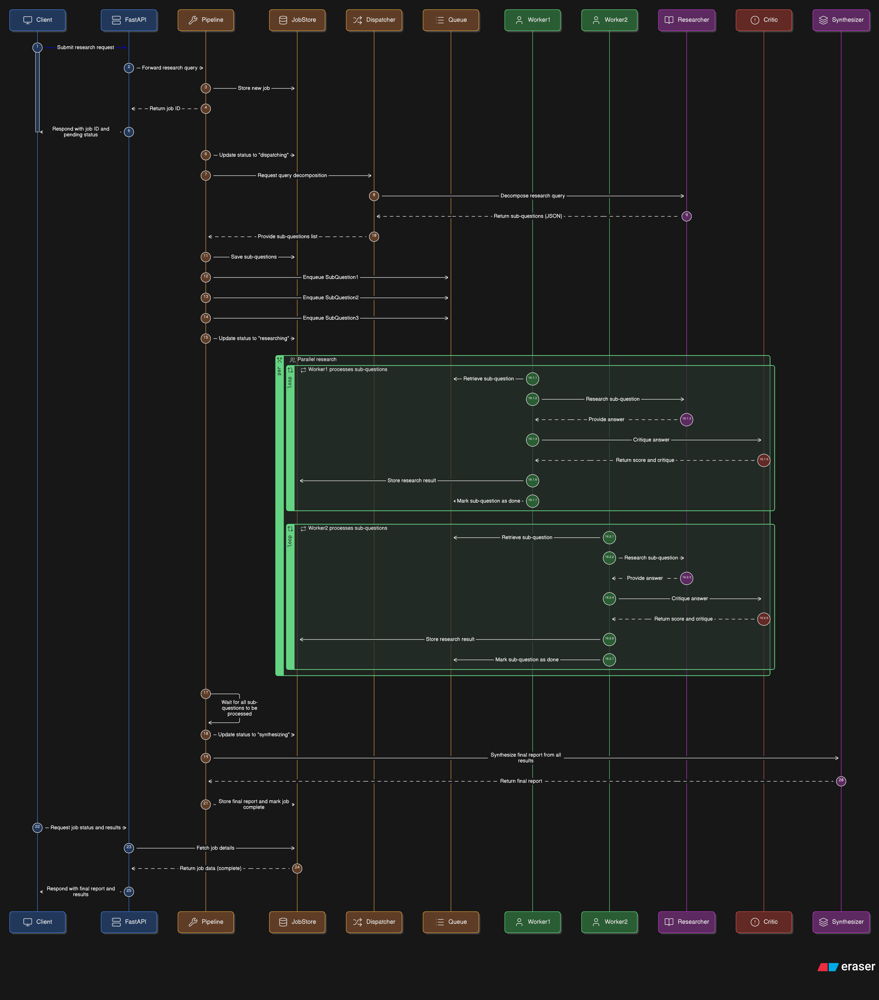

# Medical Literature Triage — Technical Documentation

---

## 1. Purpose

This system is a **multi-agent, asynchronous pipeline** that accepts a complex clinical/medical research query from a user and returns a structured, evidence-based research report.

Instead of sending the entire query to a single LLM call, the system:
1. Breaks the query into focused sub-questions (Dispatcher)
2. Researches each sub-question independently and in parallel (Researcher workers)
3. Critiques each answer for quality and confidence (Critic)
4. Synthesizes all findings into a final clinical report (Synthesizer)

The pipeline runs **in the background** — the API returns a `job_id` immediately, and the client polls for results. This is a classic **fire-and-forget + polling** pattern.

---

## 2. Tech Stack

| Layer | Technology |
|---|---|
| API Framework | FastAPI |
| Async Runtime | Python asyncio (native) |
| LLM Provider | Google Gemini (`google-genai`) |
| Data Validation | Pydantic v2 + pydantic-settings |
| Server | Uvicorn (ASGI) |

---

## 3. Project File Map

```
medical triage/
├── main.py          → FastAPI app, HTTP endpoints
├── pipeline.py      → Async orchestration logic, worker pool
├── state.py         → In-memory job store (thread-safe via asyncio.Lock)
├── models.py        → All Pydantic data models and enums
├── config.py        → Settings loaded from .env
└── agents/
    ├── base.py      → Shared LLM caller with retry + rate-limit logic
    ├── dispatcher.py → Decomposes query into sub-questions
    ├── researcher.py → Answers a single sub-question
    ├── critic.py    → Scores and critiques a researcher's answer
    └── synthesizer.py → Merges all results into a final report
```

---

## 4. Data Models (`models.py`)

### JobStatus (Enum)
Tracks the lifecycle of a job through these states in order:

```
pending → dispatching → researching → synthesizing → complete
                                                   ↘ failed
```

### SubQuestion
```python
id: int
question: str
```
A single focused question derived from the original query.

### ResearchResult
```python
sub_question: SubQuestion
answer: str
confidence_score: float  # 0.0 – 1.0
critique: str
```
The full output for one sub-question after research + critique.

### ResearchJob
The central state object for a job:
```python
job_id: str
query: str
status: JobStatus
sub_questions: list[SubQuestion]
results: list[ResearchResult]
final_report: Optional[str]
error: Optional[str]
```

### API Models
- `CreateJobRequest` — input: `{ query: str }`
- `JobStatusResponse` — output: full job state returned to the client

---

## 5. Configuration (`config.py`)

All values are loaded from `.env` via `pydantic-settings`:

| Key | Default | Purpose |
|---|---|---|
| `GEMINI_API_KEY` | required | Authenticates with Google Gemini |
| `MODEL` | `gemini-3.5-flash` | Which Gemini model to use |
| `MAX_TOKENS` | `4096` | Max output tokens per LLM call |
| `MAX_RESEARCHERS` | `2` | Number of parallel worker coroutines |
| `RESEARCHER_TIMEOUT` | `30.0` | Seconds before a single LLM call times out |
| `MAX_SUB_QUESTIONS` | `3` | How many sub-questions the dispatcher generates |

---

## 6. State Management (`state.py`)

### JobStore class
A singleton in-memory dictionary that holds all active `ResearchJob` objects.

```python
job_store = JobStore()  # one instance, imported everywhere
```

Every method is `async` and wraps all dictionary mutations inside `async with self._lock` — an `asyncio.Lock`. This prevents race conditions when multiple worker coroutines try to write results to the same job simultaneously.

### Why asyncio.Lock and not threading.Lock?
Because the entire application runs on a **single OS thread** using asyncio's event loop. `asyncio.Lock` is cooperative — it yields control back to the event loop while waiting, which is correct for async code. A `threading.Lock` would block the entire event loop.

### Methods
| Method | What it does |
|---|---|
| `create_job` | Initializes a new `ResearchJob` in the dict |
| `get_job` | Returns a job by ID (or None) |
| `update_status` | Changes the `JobStatus` field |
| `set_sub_questions` | Stores the list of `SubQuestion` objects |
| `add_result` | Appends one `ResearchResult` to the job's results list |
| `set_final_report` | Stores the final report and sets status to `complete` |
| `set_error` | Stores the error message and sets status to `failed` |

---

## 7. API Layer (`main.py`)

### Lifespan
Uses FastAPI's `@asynccontextmanager` lifespan to print startup/shutdown messages. This is the modern replacement for `@app.on_event("startup")`.

### Endpoints

#### `POST /research`
- Validates the query is not empty
- Calls `create_job(query)` which returns a `job_id`
- Returns `{ job_id, status: "pending" }` immediately
- The pipeline runs in the background — the client does not wait

#### `GET /research/{job_id}`
- Polls the `job_store` for the current state of a job
- Returns the full `JobStatusResponse` including sub-questions, results, final report, or error
- Returns `404` if the job ID does not exist

#### `GET /health`
- Simple liveness check, returns `{ status: "ok" }`

---

## 8. Asyncio Architecture — Deep Dive (`pipeline.py`)

This is the core of the system. Understanding this file means understanding the entire async design.

### 8.1 The Global Semaphore

```python
llm_semaphore = asyncio.Semaphore(2)
```

A `Semaphore` is a counter that limits how many coroutines can be inside a critical section at the same time. Here it is set to `2`, meaning **at most 2 LLM calls can be in-flight at any moment** across all workers.

- When a worker does `async with llm_semaphore:`, it decrements the counter
- If the counter is already 0, the coroutine suspends and waits
- When the block exits, the counter increments and a waiting coroutine is woken up
- This prevents hammering the Gemini API with too many concurrent requests

### 8.2 `create_job` — Fire and Forget

```python
async def create_job(query: str) -> str:
    job_id = str(uuid.uuid4())
    await job_store.create_job(job_id, query)
    asyncio.create_task(run_pipeline(job_id, query))
    return job_id
```

`asyncio.create_task()` schedules `run_pipeline` as a background task on the event loop **without awaiting it**. The function returns the `job_id` immediately. The pipeline runs concurrently while the HTTP response is already sent to the client.

### 8.3 `run_pipeline` — The Orchestrator

This is the top-level coroutine that drives the 4-stage pipeline:

**Stage 1 — Dispatch**
```python
sub_questions = await dispatch(query)
await job_store.set_sub_questions(job_id, sub_questions)
```
Calls the Dispatcher agent, gets back N `SubQuestion` objects, stores them.

**Stage 2 — Fill the Queue**
```python
queue = asyncio.Queue()
for sq in sub_questions:
    await queue.put(sq)
```
An `asyncio.Queue` is a FIFO queue safe for use across coroutines. Each sub-question is placed into it as a unit of work.

**Stage 3 — Worker Pool**
```python
workers = [
    asyncio.create_task(worker(i + 1, job_id, queue, query))
    for i in range(settings.max_researchers)
]
await queue.join()
for w in workers: w.cancel()
await asyncio.gather(*workers, return_exceptions=True)
```

- `max_researchers` (default: 2) worker coroutines are created as tasks
- All workers run concurrently, each pulling sub-questions from the queue
- `queue.join()` blocks until every item in the queue has been processed (i.e., `task_done()` called for each)
- After the queue is drained, workers are cancelled (they are in an infinite loop waiting for more work)
- `asyncio.gather(*workers, return_exceptions=True)` waits for all cancellations to complete cleanly

**Stage 4 — Synthesize**
```python
job = await job_store.get_job(job_id)
report = await synthesize(query, job.results)
await job_store.set_final_report(job_id, report)
```
All results are passed to the Synthesizer agent which produces the final report.

### 8.4 `worker` — The Unit of Execution

Each worker runs a loop:
1. Tries to pull a `SubQuestion` from the queue with `queue.get_nowait()`
2. If the queue is empty, `QueueEmpty` is raised and the worker exits cleanly
3. If a sub-question is retrieved:
   - Acquires `llm_semaphore` → calls `research()` with a timeout
   - Acquires `llm_semaphore` again → calls `critique()` with a timeout
   - Builds a `ResearchResult` and calls `job_store.add_result()`
4. Calls `queue.task_done()` in the `finally` block — this is critical for `queue.join()` to unblock

**Timeout handling:**
```python
answer = await asyncio.wait_for(research(...), timeout=settings.researcher_timeout)
```
`asyncio.wait_for` wraps a coroutine with a deadline. If it doesn't complete in time, it raises `asyncio.TimeoutError`. The worker catches this and stores a graceful failure result instead of crashing.

**Exception handling:**
Any other exception is also caught, and a failure result is stored. The worker never crashes the pipeline — it always calls `queue.task_done()` in `finally`.

---

## 9. LLM Base Layer (`agents/base.py`)

### `call_llm(prompt, system, max_retries=4)`

The single function all agents use to talk to Gemini.

**Why `asyncio.to_thread`?**
```python
response = await asyncio.to_thread(
    client.models.generate_content, ...
)
```
The `google-genai` SDK's `generate_content` is a **synchronous blocking call**. Calling it directly inside an async function would block the entire event loop, freezing all other coroutines. `asyncio.to_thread` runs it in a separate thread from the thread pool, so the event loop stays free to handle other tasks while waiting for the HTTP response from Gemini.

**Rate Limit Retry Logic:**
```python
if "429" in error_str or "RESOURCE_EXHAUSTED" in error_str:
    suggested = _extract_retry_delay(error_str)
    wait = suggested if suggested else (2 ** attempt) * 5
    await asyncio.sleep(wait)
    continue
```
- Gemini returns HTTP 429 when rate limited, often with a `retry in Xs` message in the error body
- `_extract_retry_delay` uses a regex to parse that suggested delay
- If no delay is found, exponential backoff is used: 5s, 10s, 20s, 40s
- `asyncio.sleep` yields control back to the event loop during the wait — it does not block
- Non-429 errors are raised immediately without retrying

---

## 10. Agents

### Dispatcher (`agents/dispatcher.py`)
- **Input:** original query string
- **Output:** `list[SubQuestion]`
- Prompts Gemini to return a JSON array of `{ id, question }` objects
- Handles LLM responses that wrap JSON in markdown code fences (` ```json ``` `)
- Finds the JSON array by scanning for `[` and `]` boundaries explicitly

### Researcher (`agents/researcher.py`)
- **Input:** original query + one `SubQuestion`
- **Output:** answer string
- Prompts Gemini as a medical research specialist
- Returns a structured answer with key findings, reasoning, and caveats

### Critic (`agents/critic.py`)
- **Input:** original query + `SubQuestion` + researcher's answer
- **Output:** `tuple[float, str]` — (confidence_score, critique_text)
- Prompts Gemini to return a JSON object `{ confidence_score, critique }`
- Clamps the score to `[0.0, 1.0]` regardless of what the LLM returns
- Same markdown-stripping and JSON boundary logic as the Dispatcher

### Synthesizer (`agents/synthesizer.py`)
- **Input:** original query + `list[ResearchResult]`
- **Output:** final report string
- Sorts results by confidence score descending before building the prompt (highest confidence findings first)
- Prompts Gemini to produce a unified clinical narrative, flagging low-confidence findings (< 0.6)

---

## 11. Sequence Diagram (Eraser.io code)

```
sequenceDiagram
  participant Client
  participant FastAPI
  participant Pipeline
  participant JobStore
  participant Dispatcher
  participant Queue
  participant Worker1
  participant Worker2
  participant Researcher
  participant Critic
  participant Synthesizer

  Client->>FastAPI: POST /research { query }
  FastAPI->>Pipeline: create_job(query)
  Pipeline->>JobStore: create_job(job_id, query)
  Pipeline-->>FastAPI: job_id
  FastAPI-->>Client: { job_id, status: pending }

  Note over Pipeline: asyncio.create_task fires run_pipeline in background

  Pipeline->>JobStore: update_status(dispatching)
  Pipeline->>Dispatcher: dispatch(query)
  Dispatcher->>Researcher: call_llm (decompose query)
  Researcher-->>Dispatcher: raw JSON sub-questions
  Dispatcher-->>Pipeline: [SubQuestion1, SubQuestion2, SubQuestion3]
  Pipeline->>JobStore: set_sub_questions(...)

  Pipeline->>Queue: put(SubQuestion1)
  Pipeline->>Queue: put(SubQuestion2)
  Pipeline->>Queue: put(SubQuestion3)
  Pipeline->>JobStore: update_status(researching)

  Note over Pipeline: spawn Worker1 and Worker2 as concurrent tasks

  par Worker1 loop
    Worker1->>Queue: get_nowait() → SubQuestion1
    Worker1->>Researcher: research(query, SubQuestion1) [semaphore acquired]
    Researcher-->>Worker1: answer1
    Worker1->>Critic: critique(query, SubQuestion1, answer1) [semaphore acquired]
    Critic-->>Worker1: (score1, critique1)
    Worker1->>JobStore: add_result(ResearchResult1)
    Worker1->>Queue: task_done()
  and Worker2 loop
    Worker2->>Queue: get_nowait() → SubQuestion2
    Worker2->>Researcher: research(query, SubQuestion2) [semaphore acquired]
    Researcher-->>Worker2: answer2
    Worker2->>Critic: critique(query, SubQuestion2, answer2) [semaphore acquired]
    Critic-->>Worker2: (score2, critique2)
    Worker2->>JobStore: add_result(ResearchResult2)
    Worker2->>Queue: task_done()
  end

  Note over Pipeline: queue.join() waits for all task_done() calls

  Worker1->>Queue: get_nowait() → SubQuestion3
  Worker1->>Researcher: research(query, SubQuestion3) [semaphore acquired]
  Researcher-->>Worker1: answer3
  Worker1->>Critic: critique(query, SubQuestion3, answer3) [semaphore acquired]
  Critic-->>Worker1: (score3, critique3)
  Worker1->>JobStore: add_result(ResearchResult3)
  Worker1->>Queue: task_done()

  Pipeline->>Pipeline: cancel workers
  Pipeline->>JobStore: update_status(synthesizing)
  Pipeline->>Synthesizer: synthesize(query, all_results)
  Synthesizer-->>Pipeline: final_report
  Pipeline->>JobStore: set_final_report(report) → status: complete

  Client->>FastAPI: GET /research/{job_id}
  FastAPI->>JobStore: get_job(job_id)
  JobStore-->>FastAPI: ResearchJob (complete)
  FastAPI-->>Client: { job_id, status: complete, final_report, results, ... }
```

---

## 12. Asyncio Concepts Used — Quick Reference

| Concept | Where Used | Why |
|---|---|---|
| `asyncio.create_task` | `create_job`, worker pool | Schedule coroutines to run concurrently without awaiting |
| `asyncio.Queue` | `run_pipeline` | Distribute sub-questions to workers safely |
| `queue.join()` | `run_pipeline` | Block until all queue items are processed |
| `queue.task_done()` | `worker` finally block | Signal that a queue item is fully processed |
| `asyncio.Semaphore` | `pipeline.py` global | Cap concurrent LLM calls to avoid rate limits |
| `asyncio.wait_for` | `worker` | Enforce per-call timeout on LLM operations |
| `asyncio.Lock` | `JobStore` | Prevent race conditions on shared job state |
| `asyncio.sleep` | `base.py` retry loop | Non-blocking wait during rate limit backoff |
| `asyncio.to_thread` | `base.py` call_llm | Run blocking SDK call in thread pool without blocking event loop |
| `asyncio.gather` | worker cleanup | Await multiple tasks simultaneously, collect exceptions |

---

## 13. Job Lifecycle Summary

```
POST /research
     │
     ▼
create_job()
  ├─ create ResearchJob (status: pending)
  ├─ fire run_pipeline as background task
  └─ return job_id immediately

run_pipeline() [background]
  ├─ status → dispatching
  ├─ dispatch() → sub_questions stored
  ├─ status → researching
  ├─ fill asyncio.Queue with sub_questions
  ├─ spawn N worker tasks
  ├─ queue.join() — wait for all workers to finish
  ├─ cancel workers
  ├─ status → synthesizing
  ├─ synthesize() → final_report stored
  └─ status → complete  (or failed on any unhandled exception)

GET /research/{job_id}
  └─ return current job state (poll until complete or failed)
```

---

## 14. Error Handling Strategy

| Failure Point | Handling |
|---|---|
| Empty query | FastAPI raises HTTP 400 before job is created |
| Dispatcher LLM parse failure | `RuntimeError` propagates to `run_pipeline`, job set to `failed` |
| Worker LLM timeout | `asyncio.TimeoutError` caught in worker, graceful failure result stored, pipeline continues |
| Worker unexpected exception | Caught in worker, failure result stored, pipeline continues |
| Gemini rate limit (429) | Retried up to 4 times with suggested or exponential backoff in `call_llm` |
| Non-429 LLM error | Raised immediately, no retry |
| Fatal pipeline error | Caught in `run_pipeline` top-level try/except, job set to `failed` with error message |
| Job not found on poll | FastAPI raises HTTP 404 |
